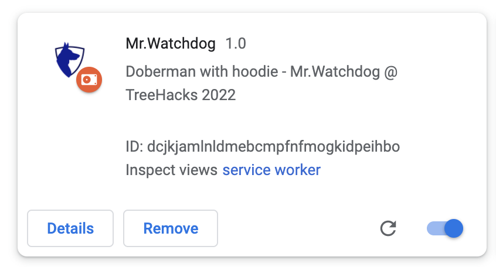

# Mr.Watchdog <a href="Watchdog"></a> @ 2022

Created by @vishalmohanty, @Victor-Peraza, @mattbal and @kinnarijpatel.

## Overview

This is a chrome extension that rates websites based on pawned history from https://haveibeenpwned.com/ and other metrics. It also reports recent breach information from https://newsapi.org/.

It shows the breach history of a website, if it is known to spread spam, download malware, and whether it uses a secure connection in connecting to client browsers.

We employ a heuristic based scoring mechanism where if a website has never been compromised, we give it a score of 100. If sensitive information has been compromised, we apply penalties depending on the severity of the compromise. For example, Adobe was breached in 2013 where email addresses, passwords were leaked amongst a bunch of other sensitive information.

<a href="Adobe"></a>

## Getting Started

### Clone the repo
```
# From Terminal.app or equivalent...

# Clone via HTTPS
$ git clone (https://github.com/vishalmohanty/hackpack-chrome-ext)
# or SSH
$ git clone git@github.com:vishalmohanty/hackpack-chromeExt.git
```

### Load Starter Code
Chrome usually ships extensions as `.crx` files (similar to `.zip` files), which is great for distribution, but not so great for developing. Instead, we'll tell Chrome to treat the starter code folder as an extension.

We need to enable Chrome Developer Settings in order to build our chrome extension.

In order to do this:

1. Navigate to [chrome://extensions](chrome://extensions) in your browser.
2. Ensure that the **Developer mode** checkbox in the top right-hand corner is checked.
3. Click **Load unpacked extension...** to pop up a file-selection dialog.
4. Navigate to the directory in which your extension files live, and select it.

You should now see a screen that looks like the below:

<a href="Loading Starter Code"></a>


Note that the **Developer mode** checkbox is checked, and the extension is enabled.

Additionally, pay close attention to the **Reload** link.

**By default, Chrome will _not_ reload your extension automatically if you update your code. Thus, if you want to test your extension, you _must_ reload the extension before testing. Otherwise, your changes will _not_ be present in the active extension.** Basically, every time you make a change to your code that you want to test live in Chrome, make sure to reload the extension using that **Reload** button.

### Credit

This is a fork from hackpacks from TreeHacks https://www.treehacks.com/.

### License
MIT
